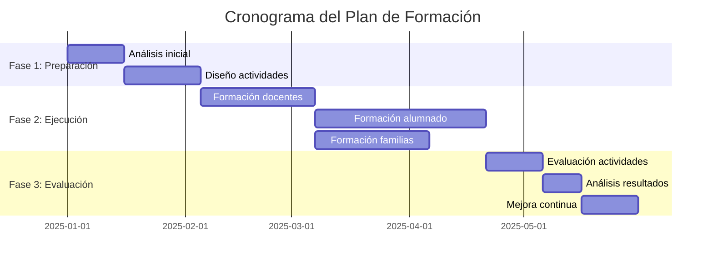

# PLAN DE FORMACIÓN Y CONCIENCIACIÓN EN CIBERSEGURIDAD

## INFORMACIÓN GENERAL DEL PLAN

### Datos Identificativos
- **Título del Plan**: [Nombre del Plan de Formación y Concienciación]
- **Organización**: [Nombre de la organización/centro educativo]
- **Responsable del Plan**: [Nombre y cargo]
- **Fecha de elaboración**: [DD/MM/AAAA]
- **Período de ejecución**: [Inicio - Fin]
- **Versión**: [X.X]


## 1. INTRODUCCIÓN Y JUSTIFICACIÓN

### 1.1. Resumen Ejecutivo
[Breve resumen del plan, sus objetivos y alcance]

### 1.2. Contexto
[Describe el contexto de la organización y la necesidad del plan de formación en ciberseguridad]

### 1.3. Marco Legal
- Real Decreto 3/2010 de 8 de enero (modificado por RD 951/2015)
- [Otras normativas aplicables]

### 1.4. Justificación
[Explica por qué es necesario este plan y qué problemáticas se pretenden resolver]


## 2. ANÁLISIS DE SITUACIÓN INICIAL

### 2.1. Recogida de Información
**Metodología**: [Describe cómo se ha recogido la información inicial]

**Herramientas utilizadas**:
- 📋 [Cuestionario inicial](./02_Formularios_RecogidaInfo/CuestionarioInicial.md)
- [Otras herramientas]

### 2.2. Diagnóstico de Necesidades
| Área                      | Nivel Actual  | Necesidad Detectada  | Prioridad  |
|---------------------------|---------------|----------------------|------------|
| [Ej: Contraseñas seguras] | Bajo          | Alta                 | Alta       |
| [Ej: Phishing]            | Medio         | Media                | Alta       |
| [Ej: Privacidad en RRSS]  | Bajo          | Alta                 | Media      |

### 2.3. Resultados del Análisis
[Resume los hallazgos más relevantes del análisis inicial]

**Estadísticas iniciales**: [Ver resultados](./02_Formularios_RecogidaInfo/Estadisticas_Iniciales/)


## 3. OBJETIVOS DEL PLAN

### 3.1. Objetivo General
[Define el objetivo principal del plan de formación]

### 3.2. Objetivos Específicos
1. **Conocimiento**: [Objetivo relacionado con conocimientos teóricos]
2. **Habilidades**: [Objetivo relacionado con competencias prácticas]
3. **Actitudes**: [Objetivo relacionado con cambios de comportamiento]
4. **Concienciación**: [Objetivo relacionado con sensibilización]

### 3.3. Indicadores de Éxito
| Objetivo     | Indicador  | Meta      | Método de Medición |
|--------------|------------|-----------|--------------------|
| [Objetivo 1] | [KPI]      | [%/valor] | [Cómo se medirá]   |
| [Objetivo 2] | [KPI]      | [%/valor] | [Cómo se medirá]   |


## 4. PÚBLICO OBJETIVO

### 4.1. Segmentación
| Perfil                      | Características      | Necesidades Formativas | Prioridad  |
|-----------------------------|----------------------|------------------------|------------|
| **Personal Docente**        | [Descripción]        | [Necesidades]          | Alta       |
| **Personal Administrativo** | [Descripción]        | [Necesidades]          | Media      |
| **Alumnado**                | [Por rangos de edad] | [Necesidades]          | Alta       |
| **Familias**                | [Descripción]        | [Necesidades]          | Media      |
| **Equipo Directivo**        | [Descripción]        | [Necesidades]          | Alta       |

### 4.2. Análisis de Necesidades por Perfil
[Detalla las necesidades específicas de cada grupo]


## 5. ROLES Y RESPONSABILIDADES

### 5.1. Equipo del Plan
| Rol                 | Responsable  | Funciones               | Dedicación     |
|---------------------|--------------|-------------------------|----------------|
| **Coordinador/a**   | [Nombre]     | [Funciones principales] | [Horas/semana] |
| **Formadores/as**   | [Nombres]    | [Funciones]             | [Horas/semana] |
| **Soporte Técnico** | [Nombre]     | [Funciones]             | [Horas/semana] |
| **Evaluador/a**     | [Nombre]     | [Funciones]             | [Horas/semana] |

### 5.2. Comité de Seguimiento
[Lista de personas que forman parte del comité de seguimiento y supervisión del plan]


## 6. ESTRATEGIAS FORMATIVAS

### 6.1. Enfoque Pedagógico
[Describe el enfoque general: constructivista, aprendizaje basado en problemas, etc.]

### 6.2. Metodologías
- ✅ **Talleres prácticos**: [Descripción]
- ✅ **Sesiones teóricas**: [Descripción]
- ✅ **Gamificación**: [Descripción]
- ✅ **Aprendizaje autodirigido**: [Descripción]
- ✅ **Casos prácticos**: [Descripción]
- ✅ **Simulaciones**: [Descripción]

### 6.3. Modalidades
- **Presencial**: [% y descripción]
- **Online síncrono**: [% y descripción]
- **Online asíncrono**: [% y descripción]
- **Híbrido**: [% y descripción]


## 7. CONTENIDOS FORMATIVOS

### 7.1. Bloques Temáticos

#### Bloque 1: Fundamentos de Ciberseguridad
- Conceptos básicos
- Amenazas más comunes
- Principios de seguridad de la información

#### Bloque 2: Contraseñas y Autenticación
- Creación de contraseñas seguras
- Gestores de contraseñas
- Autenticación multifactor (MFA)

#### Bloque 3: Phishing y Fraudes
- Identificación de correos fraudulentos
- Ingeniería social
- Protección contra estafas online

#### Bloque 4: Privacidad y Protección de Datos
- Gestión de datos personales
- RGPD básico
- Privacidad en redes sociales

#### Bloque 5: Seguridad en Dispositivos
- Actualizaciones y parches
- Antivirus y antimalware
- Configuración segura de dispositivos

#### Bloque 6: Navegación Segura
- Navegación anónima
- Riesgos en descargas
- Uso seguro de aplicaciones

#### Bloque 7: [Temáticas Específicas según Proyecto]
- Ciberacoso
- Uso excesivo de TICs
- Netiqueta
- Mediación parental
- [Otros temas relevantes]

### 7.2. Materiales Disponibles
 [Ver todos los materiales](./03_Materiales/)


## 8. ACTIVIDADES DE FORMACIÓN

### 8.1. Calendario de Actividades

| ID  | Actividad  | Público  | Duración  | Fecha   | Modalidad   | Responsable   |
|-----|------------|----------|-----------|---------|-------------|---------------|
| A01 | [Nombre]   | [Perfil] | [horas]   | [fecha] | [modalidad] | [responsable] |
| A02 | [Nombre]   | [Perfil] | [horas]   | [fecha] | [modalidad] | [responsable] |
| A03 | [Nombre]   | [Perfil] | [horas]   | [fecha] | [modalidad] | [responsable] |

### 8.2. Descripción Detallada de Actividades

#### Actividad A01: [Nombre de la actividad]
- **Objetivo**: [Objetivo específico]
- **Contenido**: [Resumen del contenido]
- **Metodología**: [Cómo se desarrollará]
- **Materiales**: 
  - [Material 1](./03_Materiales/[ruta])
  - [Material 2](./03_Materiales/[ruta])
- **Evaluación**: [Cómo se evaluará]

[Repetir estructura para cada actividad]


## 9. CRONOGRAMA

### 9.1. Fases del Plan



### 9.2. Hitos Principales

| Hito  | Fecha   | Descripción            | Criterio de Cumplimiento |
|-------|---------|------------------------|--------------------------|
| H1    | [Fecha] | [Descripción del hito] | [Criterio]               |
| H2    | [Fecha] | [Descripción del hito] | [Criterio]               |
| H3    | [Fecha] | [Descripción del hito] | [Criterio]               |

 

## 10. RECURSOS NECESARIOS

### 10.1. Recursos Humanos
- [Lista de personal necesario y dedicación]

### 10.2. Recursos Materiales
- [Equipamiento, aulas, plataformas, etc.]

### 10.3. Recursos Tecnológicos
- [Software, licencias, hardware específico]

### 10.4. Presupuesto Estimado
| Concepto     | Cantidad  | Coste Unitario  | Total   |
|--------------|-----------|-----------------|---------|
| [Concepto 1] | [X]       | [€]             | [€]     |
| [Concepto 2] | [X]       | [€]             | [€]     |
| **TOTAL**    |           |                 | **[€]** |


## 11. EVALUACIÓN DEL PLAN

### 11.1. Niveles de Evaluación

#### Nivel 1: Reacción
- **Qué se evalúa**: Satisfacción de los participantes
- **Herramientas**: 📋 [Formulario de satisfacción](./04_Formularios_Evaluacion/)

#### Nivel 2: Aprendizaje
- **Qué se evalúa**: Conocimientos adquiridos
- **Herramientas**: Tests, evaluaciones prácticas

#### Nivel 3: Transferencia
- **Qué se evalúa**: Aplicación de lo aprendido
- **Herramientas**: Observación, seguimiento

#### Nivel 4: Resultados
- **Qué se evalúa**: Impacto en la organización
- **Herramientas**: 📊 [Indicadores de ciberseguridad](./04_Formularios_Evaluacion/)

### 11.2. Indicadores de Seguimiento

| Indicador               | Fórmula de Cálculo              | Frecuencia    | Responsable   |
|-------------------------|---------------------------------|---------------|---------------|
| Tasa de participación   | (Participantes/Total)*100       | Mensual       | [Responsable] |
| Tasa de finalización    | (Finalizados/Inscritos)*100     | Por actividad | [Responsable] |
| Nivel de satisfacción   | Media valoraciones              | Por actividad | [Responsable] |
| Mejora en conocimientos | (Post-test - Pre-test)/Pre-test | Por actividad | [Responsable] |
| Reducción de incidentes | (Incidentes año N-1 - N)/N-1    | Trimestral    | [Responsable] |

### 11.3. Herramientas de Auditoría
**Checklist de Auditoría**: [Ver formulario](./04_Formularios_Evaluacion/ChecklistAuditoria.md)

Este checklist permite evaluar:
- Cumplimiento de objetivos
- Cobertura del público objetivo
- Calidad de los materiales
- Efectividad de las actividades
- Nivel de concienciación alcanzado


## 12. MEJORA CONTINUA

### 12.1. Ciclo de Mejora
1. **Planificar**: Definir objetivos y acciones
2. **Hacer**: Ejecutar las acciones planificadas
3. **Verificar**: Evaluar resultados con indicadores
4. **Actuar**: Implementar mejoras identificadas

### 12.2. Revisión del Plan
- **Frecuencia**: [Trimestral/Semestral/Anual]
- **Responsable**: [Coordinador del plan]
- **Proceso**: [Describe el proceso de revisión]

### 12.3. Acciones de Mejora
| ID  | Área de Mejora | Acción Propuesta  | Prioridad         | Plazo   | Responsable   |
|-----|----------------|-------------------|-------------------|---------|---------------|
| M01 | [Área]         | [Acción]          | [Alta/Media/Baja] | [Fecha] | [Responsable] |
| M02 | [Área]         | [Acción]          | [Alta/Media/Baja] | [Fecha] | [Responsable] |


## 13. COMUNICACIÓN Y DIFUSIÓN

### 13.1. Plan de Comunicación
- **Canales**: [Email, web, cartelería, RRSS, etc.]
- **Frecuencia**: [Periodicidad de comunicaciones]
- **Mensajes clave**: [Principales mensajes a transmitir]

### 13.2. Estrategia de Sensibilización Continua
- Recordatorios periódicos
- Campañas de concienciación
- Boletines informativos
- Eventos especiales (ej: Día de la Internet Segura)


## 14. RIESGOS Y CONTINGENCIAS

| Riesgo             | Probabilidad      | Impacto           | Plan de Contingencia |
|--------------------|-------------------|-------------------|----------------------|
| Baja participación | [Alta/Media/Baja] | [Alto/Medio/Bajo] | [Acciones a tomar]   |
| Falta de recursos  | [Alta/Media/Baja] | [Alto/Medio/Bajo] | [Acciones a tomar]   |
| Cambios normativos | [Alta/Media/Baja] | [Alto/Medio/Bajo] | [Acciones a tomar]   |


## 15. DOCUMENTACIÓN Y ANEXOS

### 15.1. Documentos de Referencia
- [Teoría: Plan de Concienciación](https://revilofe.github.io/section2/u01/teoria/IS-U1.4.1.-PlanDeConcienciacion/)
- [Ejemplo: Plan de Concienciación](https://revilofe.github.io/section2/u01/teoria/IS-U1.4.1.-PlanDeConcienciacion-Eje/)
- Carpeta `recursos/` con materiales de referencia.
- [kits de concienciación](https://files.incibe.es/incibe/kit_concienciacion/kit_concienciacion.zip)

### 15.2. Estructura de Archivos del Proyecto

```
📁 Proyecto Plan de Formación
├── 📄 README.md
├── 📄 PLAN_FormacionYConcienciacion.md (este documento)
├── 📁 01_Plan/
│   ├── 📄 PropuestaTentativa.md
│   └── 📁 Dudas_Cliente/
├── 📁 02_Formularios_RecogidaInfo/
│   ├── 📄 CuestionarioInicial.md
│   ├── 📄 AnalisisRiesgos.md
│   └── 📁 Estadisticas_Iniciales/
├── 📁 03_Materiales/
│   ├── 📁 Presentaciones/
│   ├── 📁 Guias/
│   ├── 📁 Infografias/
│   ├── 📁 Videos/
│   └── 📁 RecursosInteractivos/
├── 📁 04_Formularios_Evaluacion/
│   ├── 📄 ChecklistAuditoria.md
│   ├── 📄 FormularioSatisfaccion.md
│   ├── 📄 TestConocimientos.md
│   └── 📁 Estadisticas_Evaluacion/
└── 📁 recursos/ (material de referencia)
```


## 16. CONTROL DE VERSIONES

| Versión  | Fecha        | Autor    | Cambios Realizados    |
|----------|--------------|----------|-----------------------|
| 1.0      | [DD/MM/AAAA] | [Nombre] | Versión inicial       |
| 1.1      | [DD/MM/AAAA] | [Nombre] | [Descripción cambios] |


## 17. APROBACIONES

| Rol               | Nombre   | Firma  | Fecha   |
|-------------------|----------|--------|---------|
| **Elaborado por** | [Nombre] |        | [Fecha] |
| **Revisado por**  | [Nombre] |        | [Fecha] |
| **Aprobado por**  | [Nombre] |        | [Fecha] |


## INSTRUCCIONES DE USO DE ESTA PLANTILLA

### Cómo completar este documento:

1. **Reemplaza todos los textos entre corchetes** [como este] con información real
2. **Elimina las secciones** que no apliquen a tu proyecto
3. **Adapta las tablas** añadiendo o eliminando filas según necesidades
4. **Completa los enlaces** a documentos y materiales concretos
5. **Mantén la estructura** general para facilitar la lectura y evaluación
6. **Sé específico y práctico**: evita generalidades, concreta acciones y responsables
7. **Revisa la coherencia**: asegúrate de que objetivos, actividades e indicadores están alineados

### Checklist de completitud:

- [ ] Todos los campos [entre corchetes] están completados
- [ ] Las tablas tienen información real (no ejemplos)
- [ ] Los enlaces a materiales funcionan correctamente
- [ ] El cronograma tiene fechas realistas
- [ ] Los indicadores son medibles y tienen responsables
- [ ] Los roles tienen personas asignadas
- [ ] El presupuesto está calculado
- [ ] Las actividades tienen materiales asociados
- [ ] Los riesgos tienen planes de contingencia
- [ ] El documento ha sido revisado y aprobado

### Consejos:

- **Pragmatismo**: Enfócate en lo que realmente vas a poder ejecutar
- **Claridad**: Usa lenguaje directo y comprensible para todos los perfiles
- **Evidencias**: Vincula todo con documentos, materiales y herramientas concretas
- **Medición**: Define cómo vas a saber si has tenido éxito
- **Flexibilidad**: El plan debe poder adaptarse a cambios y circunstancias

---

** IMPORTANTE**: Este documento es la columna vertebral de tu proyecto. Dedica tiempo a completarlo con detalle y rigor, ya que será la guía para toda la ejecución del plan de formación y concienciación.
